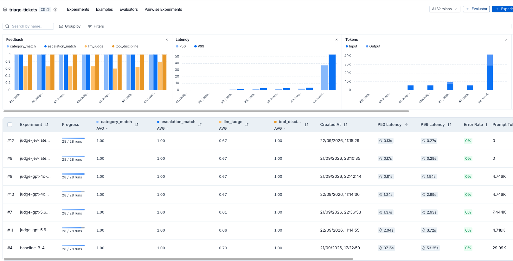

# jev-as-a-judge

Using **[TypeSafe Jev](https://typesafe.ai)** as an LLM-as-a-judge — and benchmarking it
head-to-head against frontier LLM judges on the same replies, same rubric, same dataset.

Jev is a *System One* model: it doesn't generate text. It evaluates a **state** against
typed questions and returns **calibrated probabilities**. This repo tests whether that's
actually a better fit for the judging job than asking an LLM to write out a number.

## The result

Three judge backends — **Ollama** (local), **OpenAI**, and **Jev** — graded the same 14
frozen customer-support replies, 28 runs each:

| Judge | Runtime | Type | `llm_judge` | empathy | completeness | latency/call | confidence |
|---|---|---|---|---|---|---|---|
| **jev-latest** | **TypeSafe API** | **System One** | **67.2%** | 3.69 | 3.68 | **0.148s** | **0.77** |
| gpt-4o | OpenAI API | generative LLM | 66.1% | 3.64 | 3.64 | 1.658s | — |
| gpt-5.6-terra | OpenAI API | generative LLM | 65.2% | 4.00 | 3.21 | 2.189s | — |
| gemma4-judge | Ollama (local, 4.6B Q4) | generative LLM | 79.5% | 4.07 | 4.29 | ~13.7s | — |

All four run through one interface — `Judge.grade()` in `src/judges.py`, dispatching on
`kind` (`"ollama"` / `"openai"` / `"jev"`) — so swapping judges changes one CLI flag,
not the harness.

**Jev lands within 1.1pp of gpt-4o while being ~11× faster**, and it's the only judge
that reports how sure it is.

Three independent judges cluster at **65–67%**. The local 4.6B model sits **13pp above
all of them** — it is the outlier, not the frontier models.



Every run is a tracked LangSmith experiment. Note the P50 latency column: **Jev at 0.13s
against the local baseline's 37.15s**, with identical `category_match` /
`escalation_match` / `tool_discipline` columns confirming all judges graded the same
frozen agent decisions.


## Experiment design

**The agent output is frozen.** `data/frozen_replies.json` pins one canonical reply per
ticket, so every judge grades byte-identical text. Without this, a score difference could
be the judge *or* the agent having worded things differently.

That freeze is justified by measurement, not assumption — `src/analyze_baseline.py` over
56 agent runs found:

```
routing flips        : 0        (category/escalation/tool_discipline never varied)
aggregate sd         : 0.00pp
distinct replies     : 1 per ticket
```

**Routing metrics are a tripwire, not a measurement.** `category_match`,
`escalation_match` and `tool_discipline` read the *frozen* agent decision, identical in
every experiment. They sit at 100% by construction and cannot discriminate between
judges — they exist to catch dataset corruption. Only `llm_judge` varies.

## The rubric

Jev scores against **ordered, concrete level descriptions** rather than a free-text
prompt. TypeSafe's guidance is explicit: describe situations, never vague degrees.

```python
Score(
    instructions="How completely does the agent's reply resolve what the customer asked?",
    criteria=[
        "Acknowledges the problem but answers nothing and commits to no action",
        "Promises to look into it or get back to the customer, with no answer and no timeframe",
        "States that an action was taken, but does not say who now owns it or when...",
        "States the action taken and names the team or next step, but gives no timeframe",
        "Answers the question or states the action taken, names who now owns it, and...",
    ],
)
```

This directly fixed a real failure. The old free-text rubric said only *"says what was
done and what happens next; no unanswered question"* — vague enough that `gemma4-judge`
gave **5/5** to a reply that answers nothing. Level 1 above names that exact failure
mode, so it can't hide.

Empathy and completeness are **separate** Score questions: multi-aspect questions split
the model's attention and lower confidence.

Levels are 0-indexed (0..4); `judges.py` adds 1 so results land on the same 1..5 scale
the text judges use, keeping `llm_judge` directly comparable across all four.

## Setup

```bash
python3.12 -m venv .venv
.venv/bin/pip install -r requirements.txt
cp .env.example .env
```

Keys in `.env`: `TYPESAFE_API_KEY` ([console.typesafe.ai](https://console.typesafe.ai)),
`LANGSMITH_API_KEY`, `OPENAI_API_KEY`. Ollama must be running for the local baseline.

## Run

```bash
# Jev, one Score question, one reply -- start here
.venv/bin/python src/jev_test.py

# Full judge experiment -> LangSmith (14 tickets x 2 reps = 28 runs)
.venv/bin/python src/judge_compare_experiment.py --model jev-latest   --reps 2
.venv/bin/python src/judge_compare_experiment.py --model gpt-4o       --reps 2
.venv/bin/python src/judge_compare_experiment.py --model gpt-5.6-terra --reps 2

# The agent being judged, and its baseline
.venv/bin/python src/agent.py "my order 4471 broke"
.venv/bin/python src/run_eval.py --langsmith --reps 2
.venv/bin/python src/analyze_baseline.py
```

## Layout

| File | Purpose |
|---|---|
| `src/judges.py` | All four judges behind one `grade()` interface; Jev rubric lives here |
| `src/jev_test.py` | Single Score question against a single reply — the smallest working example |
| `src/judge_compare_experiment.py` | Runs a judge as a LangSmith experiment |
| `src/freeze_replies.py` | Pins one canonical agent reply per ticket |
| `src/analyze_baseline.py` | Routing stability, per-example variance, noise floor |
| `src/agent.py`, `src/tools.py` | The triage agent being judged |
| `src/evaluators.py` | Deterministic checks + the text-judge rubric |

## Honest caveats

- **No human oracle.** This measures *agreement* and *reliability*, never accuracy. A
  judge can be perfectly self-consistent and consistently wrong. Hand-labelling the 14
  replies would convert every number here into a real accuracy figure.
- **The rubric is not held constant.** Jev got concrete level descriptions; the text
  judges got the older free-text prompt. A Jev-vs-gpt-4o gap could be the model *or* the
  rubric. (The gemma-is-lenient finding predates this and held under the old rubric too.)
- **n = 14**, single dataset, one domain. Enough to expose a 13pp judge disagreement;
  not enough to rank judges generally.
- **Run-to-run judge variance is ~1–4pp.** `gpt-5.6-terra` swung 60.7% → 65.2% across
  runs. Treat sub-5pp differences between judges as noise.
- **Jev tokens don't appear on LangSmith's graph.** It isn't a LangChain model, so there's
  no auto-instrumented child span; counts are captured into run outputs instead.

## References

* [Jev agent evals in LangSmith](https://www.langchain.com/blog/jev-agent-evals-langsmith#evaluation-with-jev)
* [Jev is now available in LangSmith evals](https://www.langchain.com/blog/jev-is-now-available-in-langsmith-evals)
* [TypeSafe docs — Score primitive](https://docs.typesafe.ai/primitives/score.md)
* [danielgshea/jev-as-a-judge](https://github.com/danielgshea/jev-as-a-judge)
